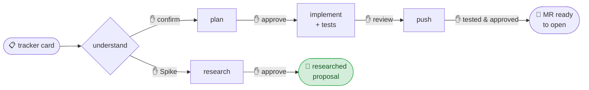
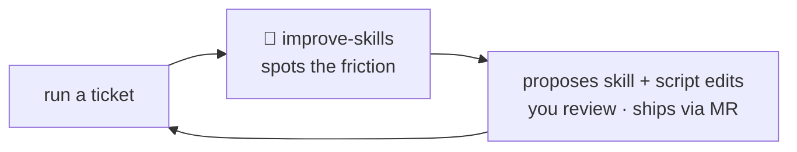

# Ticket Workflow for Claude Code

**A shared Claude Code workspace that takes a ticket from a tracker card to an MR ready to open — and improves itself as the team uses it.**

> **About this snapshot.** This is a sanitized, product-agnostic version of an internal Claude Code workflow, shared to illustrate the *pattern* — a gated, resumable, self-improving ticket lifecycle. The skill and script source isn't included; these docs describe the architecture and the practices so you can adapt them to your own stack, issue tracker, and Git host.

These Claude Code skills carry a ticket through its full lifecycle, with a human gate at every step.

It packages them for a whole team as one version-controlled workspace: the skills, the helper scripts, a shared conventions doc, and a portable settings baseline. Each workspace's `CLAUDE.md` imports the shared conventions doc, so one `git pull` updates the conventions everywhere.

## 🔄 The ticket lifecycle

One command — **`/complete-ticket PROJ-123`** — runs the whole sequence, pausing at a ✋ gate before every step so you stay in control: you confirm the understanding, approve the plan, and review the implementation; then it lays out a manual test case for every acceptance criterion (AC), which you work through before approving the push. Stories, defects and tasks take the implement-to-MR path; **spikes** branch into research and produce a **researched proposal** — ready to ship as a tracker comment, a wiki page, or a set of drafted child tickets. No code, no MR.

## 🔀 After you open the MR

Re-run `/complete-ticket` on a shipped ticket and it checks the MR's health, then routes you to the right next step — conflicts first, then review comments.

## 🚀 Getting the most out of it

The flow drafts and checks — it doesn't own the result, **you do**. Skip the real review and it just produces bad tickets faster; do it well and it frees your time for the work that actually sets quality: reviewing, testing, and refining.

- **Read the ticket yourself first** — and decide whether it's actually ready before you run `/complete-ticket`. A vague ticket produces a vague plan.
- **Pressure-test the understanding at the plan gate.** Did it grasp the *business* problem? Is it working from all the context? Is it reaching for the most appropriate, efficient solution for this case — not just a plausible one?
- **Review the implementation line by line.** Ask when something is unclear or looks off; push for changes that match engineering best practices and the existing code conventions.
- **Run the test cases like a QA would** — refine them, add the scenarios they miss, and actually execute them against the app. Don't just read them.
- **Feed the session back via `/improve-skills`** — the more you tell it about what worked and what didn't, the sharper the skills get for the next ticket.

## 🔒 What it won't do without you

- Nothing saved until you confirm the understanding it captured.
- No code until you approve the plan.
- No commit or push until you say *"tested and approved."* — and it never opens the MR for you; it hands you the URL.
- Nothing written to the tracker without explicit, per-item confirmation.
- On an open MR, `/address-review` gates before touching code, before committing, and again before the force-push.
- `/sync-repos` auto-stashes your WIP and restores it afterward. It won't silently discard your changes.

## 🧠 It improves itself

Every ticket ends with **`/improve-skills`**. It reviews the session for whatever slowed you down (a command that failed, a step that was ambiguous, a convention it didn't know) and proposes edits to its own skills and scripts. You review the diff, and nothing reaches the team until it goes through an MR like any other change.

> 🧠 **The workflow you clone today isn't the one you'll have next month.** It sharpens as the team uses it.

## ✨ What else it does for you

- **`/review <MR url>`** — reviews any MR against its tracker ACs and your team conventions, with an AC-coverage table that shows exactly what's missing.
- **`/address-review`** — reads reviewer comments, makes the fixes, and squashes them into the original commit.
- **`/sync-repos`** — syncs all your repos to their default branch in one shot.
- **Survives `/compact`** — decisions are journaled to disk as they happen, so a long ticket never loses the plot.

13 skills in all — including `understand-ticket`, `plan-ticket`, `implement-ticket`, `push-ticket`, `spike-ticket`, `new-branch`, and `prepare-mr`.

---

## 🛠️ How it's set up

The workflow lives in one version-controlled repo, shared across a developer's parallel workspaces: the skills and scripts are linked (junction on Windows, symlink on macOS/Linux) into each workspace's `.claude/`, so a single pull updates everyone. A one-shot `/setup` skill provisions the workspaces, links the skills, writes each workspace's `CLAUDE.md`, drops in a settings baseline, and clones the repos.

- **[docs/onboarding.md](docs/onboarding.md)** — how the workspace is provisioned and kept current.
- **[docs/ticket-workflow.md](docs/ticket-workflow.md)** — how the flow works, implementation *and* spike lifecycles, the gates, and the state/journal model.
- **Your own `CLAUDE.md`** — the architecture and conventions doc each workspace imports. You write this for your stack; it's what grounds the skills in your codebase.

## 🤝 Make it yours
This is a starting point, not a finished product. Adapt it to your stack and team, and if you build something better, share it back with your community.
