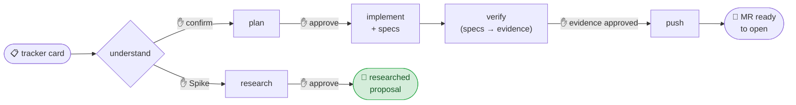
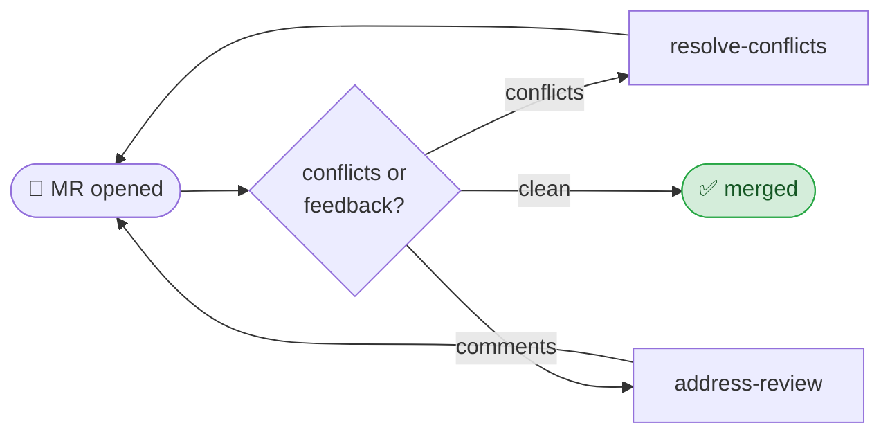
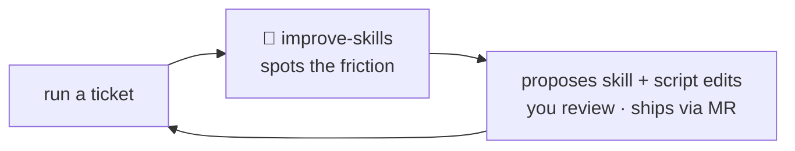

# Ticket Workflow for Claude Code

**A shared Claude Code workspace that takes a ticket from a tracker card to an MR ready to open — and improves itself as the team uses it.**

> **About this snapshot.** This is a sanitized, product-agnostic version of an internal Claude Code workflow — the *pattern* of a gated, resumable, self-improving ticket lifecycle. The skills, helper scripts, settings baseline, and e2e harness are **included** (under [`workspace/`](workspace/) and [`.claude/skills/setup`](.claude/skills/setup)); product, tracker, Git-host, and stack specifics are replaced with placeholders (`<build command>`, `<repo>`, …) for you to adapt to your own. The e2e example fixtures carry placeholder selectors/paths — clearly marked, meant to be swapped for your app.

These Claude Code skills carry a ticket through its full lifecycle, with a human gate at every step.

It packages them for a whole team as one version-controlled workspace: the skills, the helper scripts, a shared conventions doc, and a portable settings baseline. Each workspace's `CLAUDE.md` imports the shared conventions doc, so one `git pull` updates the conventions everywhere.

## 🔄 The ticket lifecycle

One command — **`/complete-ticket PROJ-123`** — runs the whole sequence, pausing at a ✋ gate before every step so you stay in control: you confirm the understanding, approve the plan, and review the implementation. Alongside the code it authors the **verification** — automated end-to-end **specs** for everything an assertion can reach, a short **manual guide** for the rest, and a **coverage matrix** so one passing case is never mistaken for full coverage. The **verify** step then runs the specs against a locally-running stack and produces an **evidence pack** (report + replayable traces + a per-AC verdict); you review that evidence (and run any manual items), and only your **"evidence reviewed and approved"** lets the push run. Stories, defects and tasks take the implement-to-MR path; **spikes** branch into research and produce a **researched proposal** — ready to ship as a tracker comment, a wiki page, or a set of drafted child tickets. No code, no MR.

## 🧱 Two layers: a domain flow on a discipline substrate

The workflow is two layers stacked, and that separation is the core idea worth borrowing:

- **The flow (domain layer)** — everything specific to *your* product and process: the lifecycle and its gates, your tracker conventions, your repo / branch / MR model, the verification evidence flow, and the state machine that resumes after a context reset. This is what these docs describe.
- **[Superpowers](https://github.com/obra/superpowers) (engineering-discipline substrate)** — a public, open-source skills library of *generic* engineering discipline: test-first development, evidence-before-claims (`verification-before-completion`), systematic debugging, plan-writing, code-review rigor, skill-authoring, and more.

**How they compose:** each flow skill **delegates** its generic discipline to a matching Superpowers skill via `REQUIRED: superpowers:*` markers, and keeps only its own domain detail. The flow's *shape is unchanged* — the substrate adds rigor to each step (test-first, root-cause-first, no "done" without evidence), it doesn't add or remove steps. Skills also keep their bodies lean by pushing heavy reference material (long checklists, exact API params, error-vs-noise tables) into sibling docs read on demand — **progressive disclosure**, so each skill loads only what the always-on prompt needs.

> **Prerequisite.** Install Superpowers once per machine (`/plugin install superpowers@claude-plugins-official`, then `/reload-plugins`); workspaces enable it via their settings baseline. The coupling is **degradable** — if the plugin isn't loaded the flow still runs and every gate is intact; you just lose the substrate disciplines. It's MIT-licensed and distributed via Anthropic's official marketplace; the only thing it auto-runs is a local context-injection hook at session start (no telemetry, no external egress) — pin/review the version before bumping.

## 🔀 After you open the MR

Re-run `/complete-ticket` on a shipped ticket and it checks the MR's health, then routes you to the right next step — conflicts first, then review comments.

## 🚀 Getting the most out of it

The flow drafts and checks — it doesn't own the result, **you do**. Skip the real review and it just produces bad tickets faster; do it well and it frees your time for the work that actually sets quality: reviewing, testing, and refining.

- **Read the ticket yourself first** — and decide whether it's actually ready before you run `/complete-ticket`. A vague ticket produces a vague plan.
- **Pressure-test the understanding at the plan gate.** Did it grasp the *business* problem? Is it working from all the context? Is it reaching for the most appropriate, efficient solution for this case — not just a plausible one?
- **Review the implementation like a teammate's PR** — scrutinise the risky, load-bearing parts closely; don't rubber-stamp it. Ask when something is unclear or looks off; push for changes that match engineering best practices and the existing code conventions.
- **Review the evidence like a QA would** — open a trace/screenshot, check the per-AC verdicts, watch for any uncovered dimension in the coverage matrix, and actually run the manual items. The specs do the running; you judge whether they prove the ACs.
- **Feed the session back via `/improve-skills`** — the more you tell it about what worked and what didn't, the sharper the skills get for the next ticket.

## 🔒 What it won't do without you

- Nothing saved until you confirm the understanding it captured.
- No code until you approve the plan.
- No commit or push until you review the verification evidence and say *"evidence reviewed and approved."* — and it never opens the MR for you; it hands you the URL.
- Nothing written to the tracker without explicit, per-item confirmation.
- On an open MR, `/address-review` gates before touching code, before committing, and again before the force-push.
- `/sync-repos` auto-stashes your WIP and restores it afterward. It won't silently discard your changes.

## 🧠 It improves itself

Every ticket ends with **`/improve-skills`**. It reviews the session for whatever slowed you down (a command that failed, a step that was ambiguous, a convention it didn't know) and proposes edits to its own skills and scripts. You review the diff, and nothing reaches the team until it goes through an MR like any other change — reviewed by the flow's owner, who reconciles conflicting edits from different devs and holds back anything that would shift the flow drastically.

> The skills improve through this loop — gated by the owner's review, so the flow sharpens without drifting.

## ✨ What else it does for you

- **`/review <MR url>`** — reviews any MR against its tracker ACs and your team conventions, with an AC-coverage table that shows exactly what's missing.
- **`/address-review`** — reads reviewer comments, makes the fixes, and either adds a second commit or squashes them into the original — your call.
- **`/start-stack`** — brings the app up locally so verification has something real to run against, pointing the UI at your *local* build (a change verified against a deployed backend proves nothing).
- **`/sync-repos`** — syncs all your repos to their default branch in one shot.
- **Survives `/compact`** — decisions are journaled to disk as they happen, so a long ticket never loses the plot.

15 skills in all (plus the one-shot `/setup` that provisions everything) — including `understand-ticket`, `plan-ticket`, `implement-ticket`, `verify-ticket`, `push-ticket`, `spike-ticket`, `start-stack`, `new-branch`, and `prepare-mr`.

---

## 🛠️ How it's set up

The workflow lives in one version-controlled repo, shared across a developer's parallel workspaces: the skills and scripts are linked (junction on Windows, symlink on macOS/Linux) into each workspace's `.claude/`, so a single pull updates everyone. A one-shot `/setup` skill provisions the workspaces, links the skills, writes each workspace's `CLAUDE.md`, drops in a settings baseline (which enables the Superpowers substrate), checks the substrate is installed, and clones the repos.

- **[docs/onboarding.md](docs/onboarding.md)** — how the workspace is provisioned and kept current.
- **[docs/ticket-workflow.md](docs/ticket-workflow.md)** — how the flow works, implementation *and* spike lifecycles, the engineering substrate, the verification evidence flow, the gates, and the state/journal model.
- **Your own `CLAUDE.md`** — the architecture and conventions doc each workspace imports. You write this for your stack; it's what grounds the skills in your codebase.

## 🤝 Make it yours
This is a starting point, not a finished product. Adapt it to your stack and team, and if you build something better, share it back with your community.
