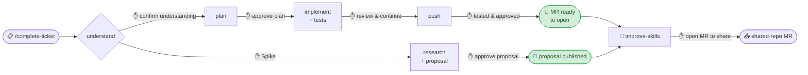
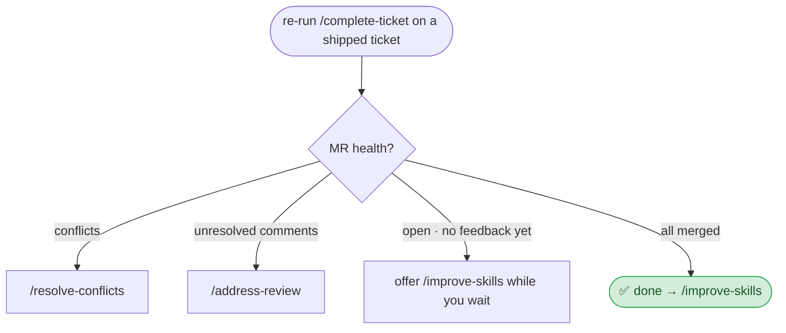
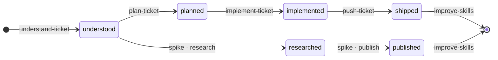
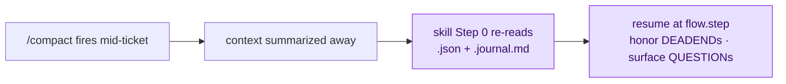

# Ticket workflow — how the skills drive a ticket

The skills form a guided, **gated** lifecycle that takes a tracker ticket from "just assigned" to a
review-ready MR you open yourself — then through the review loop to merge. **`/complete-ticket`** is
the entry point: it orchestrates the other skills, pauses at a confirmation gate before each step,
and resumes safely after a `/compact`.

> Throughout, `$WORKSPACE_ROOT` = your workspace root (the parent of `.claude/`), e.g. `C:/source/ws1`.
> All state and scripts resolve from there.

---

## The lifecycle

`/complete-ticket PROJ-123` is a small state machine. At **Step 0** it refreshes the shared skills
(a fast-forward pull of the shared clone if you're behind — so every ticket runs the latest
workflow), then reads `$WORKSPACE_ROOT/.claude/tickets/<ticket>.json`, looks at the `phase`, and
invokes the right next skill. The path forks on the ticket's issue type:

Every step transition is gated — `/complete-ticket` pauses for a ✋ confirmation before invoking the
next skill, and the skills themselves stop at their own hard gates (full list at the bottom of this
doc). The issue type (Story/Defect/Task vs. Spike) only chooses *which* branch runs, not whether a
gate fires.



### Implementation lifecycle — Story / Defect / Task

| Phase reached | Skill | What it does | Gate |
|---|---|---|---|
| `understood` | **understand-ticket** | Fetches the ticket; reads **all** ACs, comments, attachments, and the full epic; resolves dependencies (hard-stops on blockers); saves a summary. | You confirm the understanding. |
| `planned` | **plan-ticket** | Syncs repos, explores the codebase guided by the ticket context, checks for reusable code, builds a file-by-file plan with an AC-coverage map. | You sign off AC coverage **AC-by-AC**, then approve the plan — before any code is written. |
| `implemented` | **implement-ticket** | Applies every planned change, writes/updates unit tests, runs a build check, validates every AC, and self-reviews. | No hard stop of its own (HIGH findings auto-fixed) — but MEDIUM self-review findings need your call, and `/complete-ticket` shows the AC/self-review results and asks before moving to push. |
| `shipped` | **push-ticket** | Builds a manual test checklist covering **every AC** — setup, action, and expected result for each, plus a separate **negative case** for every filter/exclusion AC. After you reply **"tested and approved"**, it branches, stages only the changed files, commits, pushes, and outputs the MR URL + a paste-ready description. | Test and approve before anything is committed or pushed. |
| (after) | **improve-skills** | Reflects on the session and proposes improvements to the skills/scripts — and can open a gated MR to share them with the team. | "open MR" to share. |

### Spike lifecycle — Spike issue type

When `understand-ticket` sees the issue type is a Spike, the deliverable is a **researched proposal**,
not code or an MR:

| Phase reached | Skill | What it does |
|---|---|---|
| `understood` | **understand-ticket** | Spike-aware: captures the **research question** from the description + parent epic (ACs not required). |
| `researched` | **spike-ticket** (Phase A) | Syncs repos, researches the codebase grounded in the epic, verifies each load-bearing fact against real code, and produces a structured proposal (goal · current state · recommended approach · proposed child tickets · coverage · open questions · risks · estimates). |
| `published` | **spike-ticket** (Phase B) | Helps publish the proposal — as a tracker comment, a wiki page, and/or draft child tickets. Default is "you paste it"; auto-create via the tracker's MCP is opt-in, **per item** (every tracker write needs its own yes). |
| (after) | **improve-skills** | Same reflection step. |

---

## After you open the MR

Re-running `/complete-ticket` on a `shipped` ticket runs an **MR health check** instead of jumping
to `improve-skills`. It finds the MR(s) across all affected repos, reads conflict + unresolved-comment
state, and routes you — **conflicts always first**:



---

## How improvements travel (the loop)

Two steps bookend every ticket and keep the whole team's workflow improving:

- **Start (pull):** Step 0 of `/complete-ticket` and `/review` fast-forwards the shared clone
  if it's behind — one pull updates every workspace at once (the skills are linked in).
- **End (push):** `improve-skills` proposes skill/script edits and, on your explicit **"open MR"**,
  opens a gated MR to the shared repo. Once merged, the next Step 0 pull distributes it to everyone.

---

## Standalone skills (run directly, outside the lifecycle)

| Skill | Usage | What it does |
|---|---|---|
| **sync-repos** | `/sync-repos [api web …]` | Clones any missing repo, then syncs all to their default branch. Dirty changes are auto-stashed and restored. Reports a per-repo status table. |
| **new-branch** | `/new-branch …` | Creates the feature/bugfix branch across the affected repos, following the naming convention. |
| **review** | `/review <MR URL>` | Reviews an MR against its tracker ACs: AC-coverage table, findings by severity, team-conventions checklist; writes a review entry to the ticket JSON. |
| **address-review** | `/address-review PROJ-123` | Reads MR review threads, implements the required changes, verifies the build, and **squashes everything into the original feature commit** (force-push with lease). Gated three times: before touching code, before committing, and before the force-push. |
| **resolve-conflicts** | `/resolve-conflicts PROJ-123` | Rebases an MR branch onto its fresh target and works through the conflicts. |
| **prepare-mr** | `/prepare-mr …` | Runs the MR format/convention checks before pushing. |
| **spike-ticket** | `/spike-ticket PROJ-123` | The two-phase spike research → publish flow (above). |
| **improve-skills** | `/improve-skills` | Reflects on the session, improves the skills/scripts, and can open a gated MR to share them. |

---

## Ticket state & the context journal

This pair of files is what makes the flow **resumable** — pick a ticket back up days later, or after
a context reset, exactly where you left off. Both live under `$WORKSPACE_ROOT/.claude/tickets/` and are
**per-developer runtime state**: git-ignored, never part of the shared repo.

### `<ticket>.json` — the structured state machine

The source of truth for *where the ticket is and what was decided*. Each skill reads it at its start
and writes it at its end, advancing the `phase`:



A trimmed shape (the real file also carries `acs`, `epic`, `dependencies`, `labels`, …):

```jsonc
{
  "ticket": "PROJ-123",
  "phase": "planned",              // drives /complete-ticket routing
  "issuetype": "Story", "is_spike": false,
  "plan": {                        // the approved contract
    "branch": "feature/PROJ-123_Verb_Title",
    "repos": ["api", "web"],
    "changes": [
      { "repo": "api", "file": "src/…/Handler", "reason": "…", "acs": [1, 2] }
    ],
    "ac_coverage": { "AC 1 full text": ["api/src/…/Handler"] }   // every AC → the files that cover it
  },
  "reviews": [ { "mr_url": "…", "verdict": "needs_work", "open_comments": 3 } ],
  "flow": null                     // non-null = a skill was mid-step (the resume anchor)
}
```

- **`phase`** lets `/complete-ticket` resume routing at any time — even on a different day.
- **`plan`** is the approved file-by-file contract plus an **AC → files** coverage map, so nothing slips.
- **`reviews`** accumulates each `/review` / `/address-review`, so resolved findings aren't re-raised.

### `<ticket>.journal.md` — the *why* the JSON can't hold

The JSON holds *state*; the journal holds *reasoning*. It's a dense, append-only log written **as
things happen** via `append-journal.sh`, one line per entry — `- [timestamp] TYPE: text`:

```text
- [2026-05-29T14:02Z] DECISION: Persist the new record via the existing OrderRepository — precedent confirmed in InvoiceRepository.
- [2026-05-29T14:18Z] DEADEND:  Added a navigation property on Order → ORM cyclic-ref on save. Reverted; use an explicit join instead.
- [2026-05-29T14:31Z] QUESTION: Which transaction scope does the finally-block persist run in?
- [2026-05-29T15:05Z] RESOLVED: Reuse the outer unit-of-work (per the product owner).
```

| Type | Captures |
|---|---|
| `DECISION` | a choice **and its why** |
| `DEADEND` | an approach that failed **+ the cause** — so it's never retried |
| `QUESTION` → `RESOLVED` | an open question, then its answer |
| `NOTE` | a constraint mentioned in passing |

A short ticket may produce **zero** entries — that's correct, not a miss.

### Why it's powerful: surviving `/compact`

Long tickets outlast the context window. When `/compact` fires (often mid-step) everything in the
model's head is summarized away — but both files are **already on disk**, so the next turn rebuilds
from them:



The result: the workflow **never re-derives a decision, never retries a dead-end, and never drops an
open question** — however long the ticket runs, however many times context resets. That's what turns
`/complete-ticket` into a durable, resumable state machine instead of a one-shot prompt.

---

## Helper scripts

The skills shell out to these rather than embedding long command sequences:

| Script | Used by | Purpose |
|---|---|---|
| `sync-repos.sh` | sync-repos | Clone-if-missing, then sync each repo to its default branch; auto-stash/restore; emit a pipe-delimited status. |
| `update-standards.sh` | complete-ticket, review | At ticket start, fetch the shared clone and fast-forward if behind — distributes skill/script updates to every workspace. |
| `create-branch.sh` | new-branch | Create the feature/bugfix branch across repos. |
| `detect-wip.sh` | complete-ticket, understand-ticket, resolve-conflicts, address-review | Detect in-progress branches when state is missing. |
| `prepare-mr.sh` | push-ticket, prepare-mr, address-review | Run MR format/convention checks. |
| `push-branch.sh` | push-ticket | Push the branch to origin. |
| `rebase-branch.sh` | resolve-conflicts | Rebase a branch onto its fresh target. |
| `append-journal.sh` | all lifecycle skills | Append a line to `<ticket>.journal.md`. |
| `lib-protected.sh` | scripts | Shared guard helpers (protected-branch / safety checks). |
| `update-conversation-title.mjs` | complete-ticket, understand-ticket | Set the Claude Code conversation title to the ticket. |

---

## Gates & safety (consistent across the flow)

The workflow gates at **every step**, not just at plan and push. There are two kinds: **mandatory**
gates fire on every happy-path run; **conditional** gates fire only when a specific situation arises.

### Mandatory gates (fire on every run)

| Gate | Where | Rule |
|---|---|---|
| **Understand** | understand-ticket | Understanding is not saved to disk until you confirm it ("yes" / "looks good" / "correct"). A question or a correction does **not** count as confirmation. |
| **Step routing** | complete-ticket | Between every step you are asked before the next skill runs — _"Run /plan-ticket now?"_, _"Run /implement-ticket now?"_, etc. The orchestrator never auto-advances. |
| **Plan** | plan-ticket | No code is written until you approve the plan — an **AC-by-AC coverage sign-off**, not a blanket "ok". Any `[partial]`/`[not covered]` AC blocks approval until it's covered or explicitly accepted as out of scope. |
| **Test** | push-ticket | Nothing is committed, branched, or pushed until you reply "tested and approved". This lock holds even on a resume after `/compact`. |
| **MR creation** | push-ticket | The skill only outputs the MR URL — **you** open the MR. It never calls the Git host's create-MR API. |
| **Proposal** (spike) | spike-ticket A | The researched proposal is not saved until you approve it. |
| **Tracker writes** (spike) | spike-ticket B | Publishing needs a separate yes **per item**; a generic "go ahead" approves only the item currently shown. Default is "you paste it". |
| **Share skills** | improve-skills | Local skill/script edits are applied for you, but an MR to the shared repo opens only on an explicit "open MR". |
| **Address review** | address-review | Gated **three times**: before touching code ("go ahead"), before committing (the squash gate), and before the force-push ("push"). |
| **Resolve conflicts** | resolve-conflicts | The force-push is gated on an explicit "push"; force-push is always `--force-with-lease`. |
| **Submodules** | all git skills | Submodule pointers are never auto-staged. |

### Conditional gates (fire when the situation arises)

| Gate | Where | Fires when |
|---|---|---|
| **Existing state / WIP** | understand-ticket | Re-running on an already-started ticket, or detached WIP is detected — asks before overwriting or resuming. |
| **Blocker** | understand-ticket | A dependency is not Done/Closed — hard stop until you decide. |
| **Clarity** | understand-ticket | The ticket has 🔴 blockers or 🟡 assumptions — questions asked and answered before the understanding is saved. |
| **Sync failure** | plan-ticket, spike-ticket | A planned repo fails to sync — asks whether to continue without it. |
| **Auth unclear** | plan-ticket, implement-ticket | No authorization approach is recorded — asks before proceeding. |
| **Reference divergence** | plan-ticket | A regression fix would diverge from the known-good reference behaviour — confirms first. |
| **Out-of-scope change** | implement-ticket | A change outside the approved plan is needed — stops and tells you before doing it. |
| **Self-review (MEDIUM)** | implement-ticket, address-review | MEDIUM findings need your call (HIGH are auto-fixed, LOW are listed only). |
| **Unexpected / WIP files** | push-ticket | Working-tree files not in the plan, or WIP commits to squash — confirms each before staging. |
| **Branch verb** | push-ticket | The branch verb is not in the approved list — stops to confirm a corrected name. |
| **Sync conflict** | sync-repos | A stash restore conflicts — asks keep-conflicts vs. discard, per repo. |
| **Dropped commit** | resolve-conflicts | A rebase silently dropped a commit — requires you to confirm each drop was intentional. |
| **Semantic conflict** | resolve-conflicts | A conflict can't be safely auto-resolved — escalates with both sides shown. |
