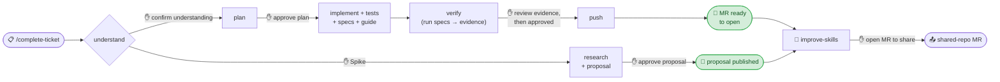
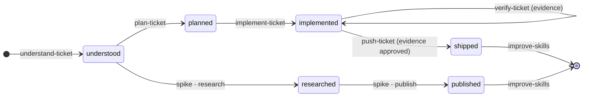
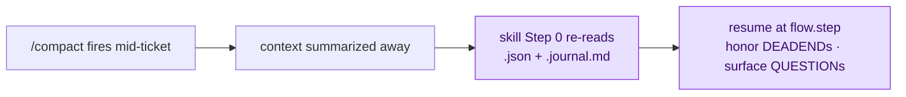

# Ticket workflow — how the skills drive a ticket

The skills form a guided, **gated** lifecycle that takes a tracker ticket from "just assigned" to a
review-ready MR you open yourself — then through the review loop to merge. **`/complete-ticket`** is
the entry point: it orchestrates the other skills, pauses at a confirmation gate before each step,
and resumes safely after a `/compact`.

> Throughout, `$WORKSPACE_ROOT` = your workspace root (the parent of `.claude/`), e.g. `C:/source/ws1`.
> All state and scripts resolve from there.

---

## The lifecycle

`/complete-ticket PROJ-123` is a small state machine. At **Step 0** it refreshes the shared skills
(a fast-forward pull of the shared clone if you're behind — so every ticket runs the latest
workflow), then reads `$WORKSPACE_ROOT/.claude/tickets/<ticket>.json`, looks at the `phase`, and
invokes the right next skill. The path forks on the ticket's issue type:

Every step is **gated** — each skill stops at its own hard gate before its result is saved (full list
at the bottom of this doc), and `/complete-ticket` adds an explicit stop of its own before push: the
**implementation review + evidence** gate. The issue type (Story/Defect/Task vs. Spike) only chooses
*which* branch runs, not whether a gate fires.



### Implementation lifecycle — Story / Defect / Task

Each step keeps its full domain behaviour; the **Delegates to** column names the [Superpowers](https://github.com/obra/superpowers) discipline (the *substrate*) it leans on for the generic engineering work, instead of re-deriving it inline. See [Engineering substrate](#engineering-substrate-superpowers) below for the why.

| Phase reached | Skill | What it does | Delegates to (substrate) | Gate |
|---|---|---|---|---|
| `understood` | **understand-ticket** | Fetches the ticket; reads **all** ACs, comments, attachments, and the full epic; resolves dependencies (hard-stops on blockers); captures the test scope (environment · identity · data); saves a summary. | `brainstorming` (surface requirement/ambiguity before planning) · `verification-before-completion` (mark a source read only with the evidence) · `systematic-debugging` (root-cause a failed fetch) · `dispatching-parallel-agents` (fan out related-ticket reads) | You confirm the understanding. |
| `planned` | **plan-ticket** | Syncs repos, explores the codebase guided by the ticket context, checks for reusable code, traces whether the change is even needed (if a layer already produces the result, it isn't planned), builds a file-by-file plan with an AC-coverage map. | `writing-plans` (plan construction) · `brainstorming` (design exploration) · `verification-before-completion` (every contract bound to real code) | You sign off AC coverage **AC-by-AC**, then approve the plan — before any code is written. |
| `implemented` | **implement-ticket** | Applies every planned change **test-first**, runs a build check, validates every AC, self-reviews — then authors the **verification**: classifies each scenario **AUTO** (an end-to-end spec covering every AC + a negative case per filter/exclusion AC) or **MANUAL** (a guide item for what can't be automated), and builds a **coverage matrix**. | `test-driven-development` (RED-GREEN-REFACTOR, **test-first**) · `systematic-debugging` (build/test failures) · `verification-before-completion` (no "done" without evidence) | Auto-advances to verify. |
| `implemented` (verified) | **verify-ticket** | Runs the AUTO specs against your running local stack, exercises destructive cases under per-scenario approval, checks the coverage matrix, and emits the **evidence pack** (report + replayable traces + per-AC verdicts). A PASS only counts when reverting the change turns the spec **red** (a negative control). | `verification-before-completion` (the honesty principle behind the evidence engine) · `systematic-debugging` (spec failures) | `/complete-ticket` shows AC/self-review results **+ the evidence pack + remaining manual items** — you reply **"evidence reviewed and approved"** before push. |
| `shipped` | **push-ticket** | Confirms the verification approval, then branches, stages only the changed files, commits, pushes, and outputs the MR URL + a paste-ready description. | `verification-before-completion` (the approval gate / lock) · `systematic-debugging` (build/sync/rebase failures) | Nothing is committed or pushed without "evidence reviewed and approved". |
| (after) | **improve-skills** | Reflects on the session and proposes improvements to the skills/scripts — and can open a gated MR to share them with the team. | `writing-skills` (governs every skill edit — an edit needs a failing baseline first) · `systematic-debugging` · `verification-before-completion` | "open MR" to share. |

### Spike lifecycle — Spike issue type

When `understand-ticket` sees the issue type is a Spike, the deliverable is a **researched proposal**,
not code or an MR:

| Phase reached | Skill | What it does | Delegates to (substrate) |
|---|---|---|---|
| `understood` | **understand-ticket** | Spike-aware: captures the **research question** from the description + parent epic (ACs not required). | Same as the implementation lifecycle. |
| `researched` | **spike-ticket** (Phase A) | Syncs repos, researches the codebase grounded in the epic, verifies each load-bearing fact against real code, and produces a structured proposal (goal · current state · recommended approach · proposed child tickets · coverage · open questions · risks · estimates). | `brainstorming` (research/design — minus its code-implementation tail; a spike ends at the proposal) · `systematic-debugging` · `verification-before-completion` (each fact bound to real code). |
| `published` | **spike-ticket** (Phase B) | Helps publish the proposal — as a tracker comment, a wiki page, and/or draft child tickets. Default is "you paste it"; auto-create via the tracker's MCP is opt-in, **per item** (every tracker write needs its own yes). | (publish handoff — keeps the per-item tracker-write safety contract). |
| (after) | **improve-skills** | Same reflection step. | `writing-skills` · `systematic-debugging` · `verification-before-completion`. |

---

### Engineering substrate (Superpowers)

The flow above is unchanged — same steps, same gates, same domain machinery. What changed underneath
is *where the generic engineering discipline lives*: each skill **delegates** it to a matching
[Superpowers](https://github.com/obra/superpowers) skill (the *substrate*) rather than re-deriving it
inline. The skill keeps the domain-specific layer (the plan schema, the AC-by-AC gate, the evidence
pack, the git/branch/MR procedure); the substrate supplies the underlying discipline. Each skill
records exactly what it leans on in its own **"## Required disciplines (Superpowers substrate)"** block.

| Step | Substrate skill(s) it delegates to | Domain layer it keeps |
|---|---|---|
| **understand-ticket** | `brainstorming`, `verification-before-completion`, `systematic-debugging`, `dispatching-parallel-agents` | Multi-source fetch, dependency rules, test-scope capture, the understanding gate. |
| **plan-ticket** | `writing-plans`, `brainstorming`, `verification-before-completion` | AC-by-AC gate, plan schema, the "is the change even needed?" trace. |
| **implement-ticket** | `test-driven-development` (**test-first**), `systematic-debugging`, `verification-before-completion` | Security-by-default, the AUTO/MANUAL + coverage-matrix authoring. |
| **verify-ticket** | `verification-before-completion`, `systematic-debugging` | Evidence pack/portal, negative control, destructive/DB-write approval. |
| **push-ticket** | `verification-before-completion`, `systematic-debugging` | Approval gate/lock, branch + MR plumbing. |
| **review · address-review** | `requesting-`/`receiving-code-review`, `verification-before-completion`, `systematic-debugging` | MR-vs-AC mapping, conventions checklist, additive/squash re-push. |
| **improve-skills** | `writing-skills`, `systematic-debugging`, `verification-before-completion` | Linkage/freshen checks, the share gate. |

Two principles travel with the substrate and are worth lifting on their own:

- **A green gate is necessary, not sufficient.** Before approving completed work, confirm the depth
  checks actually *ran* (produced output, not a ticked box) — and when a known-good reference exists,
  **diff the produced work against it.** A passing gate over an unexamined diff is process theatre.
- **Progressive disclosure.** Skills keep their bodies lean by pushing heavy reference material (long
  checklists, exact API params, error-vs-noise tables) into sibling docs read on demand — so the
  always-loaded prompt carries only its gates and control flow, never the lookup tables.

> **The git model is unchanged.** The flow stays **branch-per-repo + MR, with no git worktrees** —
> Superpowers' worktree and branch-finishing skills were deliberately **not** adopted. The delegation
> is about *engineering discipline*, not git topology.

---

## After you open the MR

Re-running `/complete-ticket` on a `shipped` ticket runs an **MR health check** instead of jumping
to `improve-skills`. It finds the MR(s) across all affected repos, reads conflict + unresolved-comment
state, and routes you — **conflicts always first**:


---

## How improvements travel (the loop)

Two steps bookend every ticket and keep the whole team's workflow improving:

- **Start (pull):** Step 0 of `/complete-ticket` and `/review` fast-forwards the shared clone
  if it's behind — one pull updates every workspace at once (the skills are linked in).
- **End (push):** `improve-skills` proposes skill/script edits and, on your explicit **"open MR"**,
  opens a gated MR to the shared repo. The flow's owner reviews every such MR — reconciling conflicting
  edits from different devs and holding back changes that would shift the flow drastically — and once
  merged, the next Step 0 pull distributes it to everyone.

---

## Standalone skills (run directly, outside the lifecycle)

| Skill | Usage | What it does | Delegates to (substrate) |
|---|---|---|---|
| **sync-repos** | `/sync-repos [api web …]` | Clones any missing repo, then syncs all to their default branch. Dirty changes are auto-stashed and restored. Reports a per-repo status table. | Light: `verification-before-completion` (never "all synced" without the script's own output) · `systematic-debugging`. |
| **start-stack** | `/start-stack [PROJ-123]` | The **stack bring-up layer** — runs the app locally so verification has something real to run against, and **points the UI at your local build** (a change verified against a deployed backend proves nothing), then reports readiness + URLs. `verify-ticket` invokes it before running specs. | `systematic-debugging` (root-cause a service that won't come up) · `verification-before-completion` (no "ready" without a green probe). |
| **new-branch** | `/new-branch …` | Creates the feature/bugfix branch across the affected repos, following the naming convention. | Light: `verification-before-completion` (report "branched" only from the script's own output). |
| **review** | `/review <MR URL \| PROJ-123>` | Reviews MR(s) against the ticket's ACs: AC-coverage table, findings by severity, team-conventions checklist; writes a review entry to the ticket JSON. | `requesting-code-review` (review rigor) · `receiving-code-review` (reconcile prior reviewers) · `verification-before-completion` (every "covered"/"approve" backed by the diff hunk). |
| **address-review** | `/address-review PROJ-123` | Reads MR review threads, implements the required changes, verifies the build, then commits per your chosen strategy — an **additive second commit** (plain push) or a **squash into the original commit** (force-push with lease). Gated three times: before touching code, before committing, and before the push. | `receiving-code-review` (challenge feedback, don't blindly comply) · `systematic-debugging` · `verification-before-completion`. |
| **resolve-conflicts** | `/resolve-conflicts PROJ-123` | Rebases an MR branch onto its fresh target and works through the conflicts. | `systematic-debugging` (root-cause the conflict) · `verification-before-completion` (no markers / dropped lines; push actually landed). |
| **prepare-mr** | `/prepare-mr …` | Runs the MR format/convention checks before pushing. | Light: `verification-before-completion` (call a check PASS only on the script's own PASS lines). |
| **spike-ticket** | `/spike-ticket PROJ-123` | The two-phase spike research → publish flow (above). | `brainstorming` · `systematic-debugging` · `verification-before-completion`. |
| **improve-skills** | `/improve-skills` | Reflects on the session, improves the skills/scripts, and can open a gated MR to share them. | `writing-skills` (governs every skill edit) · `systematic-debugging` · `verification-before-completion`. |

---

## Ticket state & the context journal

This pair of files is what makes the flow **resumable** — pick a ticket back up days later, or after
a context reset, exactly where you left off. Both live under `$WORKSPACE_ROOT/.claude/tickets/` and are
**per-developer runtime state**: git-ignored, never part of the shared repo.

### `<ticket>.json` — the structured state machine

The source of truth for *where the ticket is and what was decided*. Each skill reads it at its start
and writes it at its end, advancing the `phase`:



A trimmed shape (the real file also carries `acs`, `epic`, `dependencies`, `labels`, …):

```jsonc
{
  "ticket": "PROJ-123",
  "phase": "planned",              // drives /complete-ticket routing
  "issuetype": "Story", "is_spike": false,
  "plan": {                        // the approved contract
    "branch": "feature/PROJ-123_Verb_Title",
    "repos": ["api", "web"],
    "changes": [
      { "repo": "api", "file": "src/…/Handler", "reason": "…", "acs": [1, 2] }
    ],
    "ac_coverage": { "AC 1 full text": ["api/src/…/Handler"] }   // every AC → the files that cover it
  },
  "reviews": [ { "mr_url": "…", "verdict": "needs_work", "open_comments": 3 } ],
  "flow": null                     // non-null = a skill was mid-step (the resume anchor)
}
```

- **`phase`** lets `/complete-ticket` resume routing at any time — even on a different day.
- **`plan`** is the approved file-by-file contract plus an **AC → files** coverage map, so nothing slips.
- **`reviews`** accumulates each `/review` / `/address-review`, so resolved findings aren't re-raised.

### `<ticket>.journal.md` — the *why* the JSON can't hold

The JSON holds *state*; the journal holds *reasoning*. It's a dense, append-only log written **as
things happen** via `append-journal.sh`, one line per entry — `- [timestamp] TYPE: text`:

```text
- [2026-05-29T14:02Z] DECISION: Persist the new record via the existing OrderRepository — precedent confirmed in InvoiceRepository.
- [2026-05-29T14:18Z] DEADEND:  Added a navigation property on Order → ORM cyclic-ref on save. Reverted; use an explicit join instead.
- [2026-05-29T14:31Z] QUESTION: Which transaction scope does the finally-block persist run in?
- [2026-05-29T15:05Z] RESOLVED: Reuse the outer unit-of-work (per the product owner).
```

| Type | Captures |
|---|---|
| `DECISION` | a choice **and its why** |
| `DEADEND` | an approach that failed **+ the cause** — so it's never retried |
| `QUESTION` → `RESOLVED` | an open question, then its answer |
| `NOTE` | a constraint mentioned in passing |

A short ticket may produce **zero** entries — that's correct, not a miss.

### Why it's powerful: surviving `/compact`

Long tickets outlast the context window. When `/compact` fires (often mid-step) everything in the
model's head is summarized away — but both files are **already on disk**, so the next turn rebuilds
from them:



The result: the workflow **never re-derives a decision, never retries a dead-end, and never drops an
open question** — however long the ticket runs, however many times context resets. That's what turns
`/complete-ticket` into a durable, resumable state machine instead of a one-shot prompt.

---

## Helper scripts

The skills shell out to these rather than embedding long command sequences:

| Script | Used by | Purpose |
|---|---|---|
| `sync-repos.sh` | sync-repos | Clone-if-missing, then sync each repo to its default branch; auto-stash/restore; emit a pipe-delimited status. |
| `update-standards.sh` | complete-ticket, review | At ticket start, fetch the shared clone and fast-forward if behind — distributes skill/script updates to every workspace. |
| `create-branch.sh` | new-branch | Create the feature/bugfix branch across repos. |
| `detect-wip.sh` | complete-ticket, understand-ticket, resolve-conflicts, address-review | Detect in-progress branches when state is missing. |
| `prepare-mr.sh` | push-ticket, prepare-mr, address-review | Run MR format/convention checks. |
| `push-branch.sh` | push-ticket | Push the branch to origin. |
| `rebase-branch.sh` | resolve-conflicts | Rebase a branch onto its fresh target. |
| `append-journal.sh` | all lifecycle skills | Append a line to `<ticket>.journal.md`. |
| `save-state.sh` | all lifecycle skills | Persist `<ticket>.json` (validated, atomic, no approval prompt). |
| `save-test-guide.sh` | implement-ticket | Persist the manual guide for scenarios that can't be automated. |
| `ensure-superpowers.sh` | setup | Make the Superpowers substrate plugin present on the machine (user scope, idempotent). |
| `ensure-e2e.sh` | implement-ticket, verify-ticket | Provision the e2e verification harness into the workspace on first use. |
| `lib-protected.sh` | scripts | Shared guard helpers (protected-branch / safety checks). |
| `update-conversation-title.mjs` | complete-ticket, understand-ticket | Set the Claude Code conversation title to the ticket. |

---

## Gates & safety (consistent across the flow)

The workflow gates at **every step**, not just at plan and push. In short: nothing is saved until you
confirm the understanding, no code until you approve the plan, nothing committed or pushed until you
review the evidence and say *"evidence reviewed and approved"* — and it never opens the MR or writes to
the tracker for you. There are two kinds: **mandatory** gates fire on every happy-path run;
**conditional** gates fire only when a specific situation arises.

### Mandatory gates (fire on every run)

| Gate | Where | Rule |
|---|---|---|
| **Understand** | understand-ticket | Understanding is not saved to disk until you confirm it ("yes" / "looks good" / "correct"). A question or a correction does **not** count as confirmation. |
| **Step routing** | complete-ticket | `understood → plan → implement → verify` auto-advance (each previous skill's own gate already authorized continuing). The orchestrator adds two explicit stops of its own: the **implementation review + evidence** gate before push, and the yes/no offer before the terminal `improve-skills`. |
| **Plan** | plan-ticket | No code is written until you approve the plan — an **AC-by-AC coverage sign-off**, not a blanket "ok". Any `[partial]`/`[not covered]` AC blocks approval until it's covered or explicitly accepted as out of scope. |
| **Verify & evidence** | verify-ticket → complete-ticket → push-ticket | `verify-ticket` runs the specs and emits the evidence pack; nothing is committed, branched, or pushed until you review it and reply "evidence reviewed and approved" at the implementation review gate. Destructive specs need **per-scenario approval** before they run; any post-approval fix voids the approval **and** the evidence — re-verify. This lock holds even on a resume after `/compact`. |
| **Green gates ≠ done** | complete-ticket | Passing checks don't authorize approval on their own: the review gate confirms the depth checks actually *ran*, and — when a known-good reference exists — **A/B's the produced code against it**. A passing gate over an unexamined diff is process theatre. |
| **MR creation** | push-ticket | The skill only outputs the MR URL — **you** open the MR. It never calls the Git host's create-MR API. |
| **Proposal** (spike) | spike-ticket A | The researched proposal is not saved until you approve it. |
| **Tracker writes** (spike) | spike-ticket B | Publishing needs a separate yes **per item**; a generic "go ahead" approves only the item currently shown. Default is "you paste it". |
| **Share skills** | improve-skills | Local skill/script edits are applied for you, but an MR to the shared repo opens only on an explicit "open MR". |
| **Address review** | address-review | Gated **three times**: before touching code ("go ahead" + commit strategy: additive or squash), before committing, and before the push ("push" — plain push for additive, force-push for squash). |
| **Resolve conflicts** | resolve-conflicts | The force-push is gated on an explicit "push"; force-push is always `--force-with-lease`. |
| **Submodules** | all git skills | Submodule pointers are never auto-staged. |

### Conditional gates (fire when the situation arises)

| Gate | Where | Fires when |
|---|---|---|
| **Existing state / WIP** | understand-ticket | Re-running on an already-started ticket, or detached WIP is detected — asks before overwriting or resuming. |
| **Blocker** | understand-ticket | A dependency is not Done/Closed — hard stop until you decide. |
| **Clarity** | understand-ticket | The ticket has 🔴 blockers or 🟡 assumptions — questions asked and answered before the understanding is saved. |
| **Sync failure** | plan-ticket, spike-ticket | A planned repo fails to sync — asks whether to continue without it. |
| **Auth unclear** | plan-ticket, implement-ticket | No authorization approach is recorded — asks before proceeding. |
| **Reference divergence** | plan-ticket | A regression fix would diverge from the known-good reference behaviour — confirms first. |
| **Out-of-scope change** | implement-ticket | A change outside the approved plan is needed — stops and tells you before doing it. |
| **Self-review (MEDIUM)** | implement-ticket, address-review | MEDIUM findings need your call (HIGH are auto-fixed, LOW are listed only). |
| **Unexpected / WIP files** | push-ticket | Working-tree files not in the plan, or WIP commits to squash — confirms each before staging. |
| **Branch verb** | push-ticket | The branch verb is not in the approved list — stops to confirm a corrected name. |
| **Sync conflict** | sync-repos | A stash restore conflicts — asks keep-conflicts vs. discard, per repo. |
| **Dropped commit** | resolve-conflicts | A rebase silently dropped a commit — requires you to confirm each drop was intentional. |
| **Semantic conflict** | resolve-conflicts | A conflict can't be safely auto-resolved — escalates with both sides shown. |
